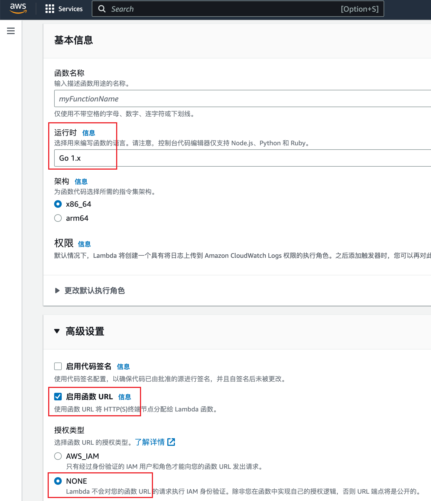
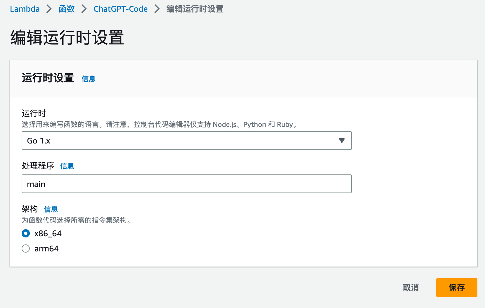

#ChatGPT AWS Proxy

[](https://goreportcard.com/report/github.com/nangcr/chatgpt- aws-proxy)
[](https://raw.githubusercontent.com/nangcr/chatgpt-aws-proxy/master/LICENSE )
[](https://godoc.org/github.com/nangcr/chatgpt -aws-proxy)

This project is an AWS Lambda function to forward HTTP requests to OpenAI's ChatGPT API. The code of this project is written in Go language and can also be deployed on any VPS.

## Features
This project has added jwt authentication to avoid scenarios such as openai key being exposed to the client.
## Usage
If you want to compile and deploy to the VPS by yourself, please modify the startup command in the last line of the main function and make sure to compile to the correct target platform.
Note that SECRET_KEY and OPENAI_API_KEY are configured in the running environment

To deploy this Lambda function, you can directly download the compiled deployment package, or refer to the following steps to compile it yourself:

### Build deployment package
Make sure you have the Go programming language and GNU Make tools installed.

To get started, clone this repository or download the source code, then build the deployment package with:
``` bash
make build
```
This command will build a Linux binary and a Zip archive. The zip file contains the binary and can be used to deploy the Lambda function.

You can then deploy your Lambda function as follows:

### Create a Lambda function
In the AWS Lambda function console, create a new Lambda function. Select the runtime as Go 1.x, check the "Enable function URL" option in the advanced settings, and select the authorization type as required.



Next, you can upload the deployment package to the Lambda function through the Lambda function console.

Make sure the "Handler" name is main in your runtime settings.



You can also upload a deployment package into a Lambda function using the AWS CLI:

``` bash
make deploy
```

**Please Note: The Makefile is written by ChatGPT and has not been tested, please be sure to check the Makefile before using it. **

## refer to
[AWS Lambda Developer Guide](https://docs.aws.amazon.com/lambda/latest/dg/welcome.html)

[AWS CLI Command Reference](https://docs.aws.amazon.com/cli/latest/reference/)

[OpenAI API Documentation](https://beta.openai.com/docs/api-reference/introduction)

## license
This project is open source software licensed under the MIT license. See the LICENSE file for more information.

## contribute
If you want to contribute to the project, you can ask an issue, suggest a new feature, file a bug report, or create a pull request. We welcome all contributors.

## Acknowledgments
This project is modified from [Nangcr](https://github.com/nangcr).
Thanks to OpenAI team for providing excellent ChatGPT API, and AWS team for providing stable and reliable Lambda and API Gateway services.